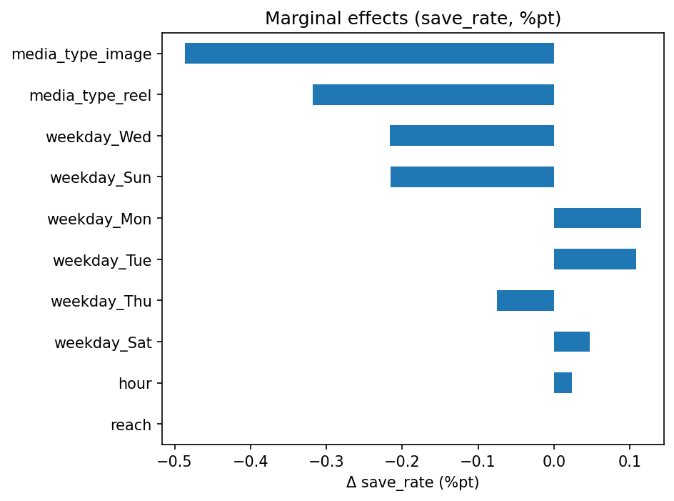

📄 [完全版サマリーはこちら](README_final_cleaned.md)

**目次**｜[目的](#目的) / [手順](#手順超要約) / [主な結果](#主な結果) / [示唆](#示唆saya向け) / [図](#図ridge-実測-vs-予測) / [保存率](#保存率save_rateの予測) / [交互作用](#時刻媒体の交互作用likes) / [付録](#付録数表) / [TL;DR](#tldr) / [Contact](#contact)

# SNS投稿の「いいね」予測・示唆（1枚サマリ） — for Saya
*作成日: 2025-08-09 / データ: サンプル60件（SNS投稿CSV）*

## 目的
- 投稿の **「いいね（likes）」を予測** し、運用に活かせる **配信タイミング/施策** の当たりをつける。

## 手順（超要約）
1. 前処理：`media_type`, `weekday` は One-Hot（drop='first'）、数値は標準化。
2. モデル：線形回帰 & Ridge 回帰（CVで α 自動選択）。train/test=80/20。
3. 妥当性チェック：平均予測（ベースライン）比較、`impressions`除外の検証、係数/Permutationでドライバー把握。

## 主な結果
- **MAE（平均予測）= 208.40 → 線形= 88.68（R²=0.820）**
- **Ridge= 63.62（R²=0.909, α=4.28）**  ← 係数が安定しやすく、**最終採用**
- 集計より：**18時が最も平均エンゲージメント高い**（夜帯強め）
- ドライバー概観：**reach ＞ 曜日差 ＞ media_type**

## 示唆（Saya向け）
- **夜18時中心で投稿比率↑**、`reel`起点の企画を重点チェック。
- **到達の質（保存/コメント率）**にフォーカス。`reach` の増加が likes に直結。
- `impressions` は冗長気味 → **レポートは率（likes/imp）も並記**して質を監視。

## 図（Ridge: 実測 vs 予測）

- 図1.Ridge:実測　vs　予測
---

### 保存率（save_rate）の予測：重み付きRidge
- **モデル**：Ridge（weights = impressions）
- **指標**：MAE(平均予測)=**0.0041** → モデル=**0.0047**（**改善率 -13.7%**）／ **R²=-0.359**
- **解釈**：印象回数で重み付けしても今回は**精度は改善せず**。小標本＋保存率のばらつきや重みの偏りの影響が大きい可能性。  
  次は **二項GLM（ロジット）** や **コンテンツ特徴の追加** で再検証を提案。

  

---

### 時刻×媒体の交互作用（likes）
- **モデル**：Ridge（交互作用 `hour×media_type`、共変量 `reach`）
- **指標**：**R²=0.906 / MAE=68.5**
- **結果**：予測曲線より **夜×carousel の傾きが最も大きい**。reel は中位、image は控えめ。
- **施策**：夜は **carousel を厚め**、昼は image / reel のABテスト。保存・コメント導線で“質”を上げる。

  

  

図2. 時刻×媒体の交互作用
---

### 付録：数表
| 指標 | 値 |
|---|---:|
| MAE（平均予測） | 208.40 |
| MAE / R²（線形） | 88.68 / 0.820 |
| MAE / R²（Ridge, α=4.28） | 63.62 / 0.909 |

> ※ サンプル生成データでの結果です（実データでは特徴追加で改善余地あり）。

## TL;DR
Ridge回帰で likes 予測（R²=0.909 / MAE=63.6）。主要因は reach。**夜18時中心×保存/コメント設計**を推奨。

## Contact
お仕事/ご相談: ✉️ tianzhongzaoji80@gmail.com ｜ X: https://x.com/1046vsaki_saya

### 保存率（save_rate）の予測：二項GLM（ロジット）

- **モデル**: GLM Binomial（endog=保存率, `var_weights = impressions`）
- **指標**: MAE = **0.0060** ／ **Pseudo R² ≈ 0.169**
- **要点**: 保存を【成功/試行】として扱う正攻法。小標本＆ノイズ多めでも一定の説明力。
  係数上位（図の右側）が保存率を押し上げる要因（例: reach, ○○曜日, media_type=○○ など）。

- 保存率用のテンプレCSV: [`data/mfx_save_rate_glm.csv`](data/mfx_save_rate_glm.csv)

## 保存率（save_rate）の予測：GLM（ロジット）

- **モデル**：GLM Binomial（endog = 保存率、`var_weights=impressions`）
- **指標**：MAE ≈ **0.0060** ／ 擬似R² ≈ **0.169**
- **要点**：
  - 小標本＋ノイズ多めの中でも一定の説明力。**重み付き**（impressions）で “試行回数” を考慮。
  - **メディア種別**や**曜日**に効果の差。質的施策（保存誘発のCTA/構成）が効く余地あり。

**実測 vs 予測（保存率）**

**係数（CSV）**
- [coef_save_rate_glm.csv](./data/coef_save_rate_glm.csv)

- ### 保存率（save_rate）の予測：二項GLM（ロジット）

- モデル：GLM Binomial（endog=保存率、`var_weights=impressions`）
- 指標：MAE ≈ **0.0060** ／ 擬似R² ≈ **0.169**
- 主要因子（%ポイント, 一例）：  
  - Wed **-0.587** ／ hour **-0.196** ／ reach **+0.0003** ／ reel **+0.342**
- 示唆：水曜は弱め、**reel** は保存率にプラス。時間は遅いほど低下傾向。  
  reach は保存率自体の押し上げは小さいため、**保存導線（チェックリスト／解説／CTA）** で質を上げる。

（表）[mfx_save_rate_glm.csv](./mfx_save_rate_glm.csv)

・image / reel は（carousel基準で）保存率が低下傾向  
・水曜・日曜は低め、Mon/Tue はやや高め 
・hour は遅くなるほど微減、reach の寄与は極小

GLM (logit), var_weights=impressions, MAE≈0.0060, 擬似R²≈0.169
# 保存率改善レポート

GLM（ロジット）、var_weights=impressions、MAE≈0.0060、擬似R²≈0.169

このアクションマップは、投稿の保存率を向上させるための改善施策を視覚化したものです。
