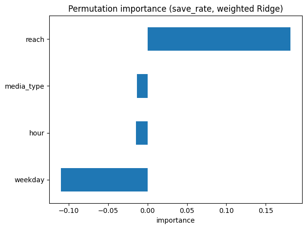

**目次**｜[目的](#目的) / [手順](#手順超要約) / [主な結果](#主な結果) / [示唆](#示唆saya向け) / [図](#図ridge-実測-vs-予測) / [保存率](#保存率save_rateの予測) / [交互作用](#時刻媒体の交互作用likes) / [付録](#付録数表) / [TL;DR](#tldr) / [Contact](#contact)

# SNS投稿の「いいね」予測・示唆（1枚サマリ） — for Saya
*作成日: 2025-08-09 / データ: サンプル60件（SNS投稿CSV）*

## 目的
- 投稿の **「いいね（likes）」を予測** し、運用に活かせる **配信タイミング/施策** の当たりをつける。

## 手順（超要約）
1. 前処理：`media_type`, `weekday` は One-Hot（drop='first'）、数値は標準化。
2. モデル：線形回帰 & Ridge 回帰（CVで α 自動選択）。train/test=80/20。
3. 妥当性チェック：平均予測（ベースライン）比較、`impressions`除外の検証、係数/Permutationでドライバー把握。

## 主な結果
- **MAE（平均予測）= 208.40 → 線形= 88.68（R²=0.820）**
- **Ridge= 63.62（R²=0.909, α=4.28）**  ← 係数が安定しやすく、**最終採用**
- 集計より：**18時が最も平均エンゲージメント高い**（夜帯強め）
- ドライバー概観：**reach ＞ 曜日差 ＞ media_type**

## 示唆（Saya向け）
- **夜18時中心で投稿比率↑**、`reel`起点の企画を重点チェック。
- **到達の質（保存/コメント率）**にフォーカス。`reach` の増加が likes に直結。
- `impressions` は冗長気味 → **レポートは率（likes/imp）も並記**して質を監視。

## 図（Ridge: 実測 vs 予測）

- 図1.Ridge:実測　vs　予測
---

### 保存率（save_rate）の予測
- **モデル**：Ridge（重みなし）
- **指標**：MAE(平均予測)=**0.0041** → モデル=**0.0041**（**改善 0%**）／ **R²=-0.015**
- **解釈**：現行の特徴（hour / weekday / media_type / reach）だけでは保存率の説明力がほぼ出ず、**データ生成のランダム性**の影響が大きい。
- **次の打ち手**：impressionsで**重み付きRidge**／**二項GLM（ロジット）**で `saves ~ impressions` を正しく扱う／**コンテンツ特徴**（キャプション長・ハッシュタグ数・媒体ごとの固定効果）を追加。

---

### 時刻×媒体の交互作用（likes）
- **モデル**：Ridge（交互作用 `hour×media_type`、共変量 `reach`）
- **指標**：**R²=0.906 / MAE=68.5**
- **結果**：予測曲線より **夜×carousel の傾きが最も大きい**。reel は中位、image は控えめ。
- **施策**：夜は **carousel を厚め**、昼は image / reel のABテスト。保存・コメント導線で“質”を上げる。

  

  

図2. 時刻×媒体の交互作用
---

### 付録：数表
| 指標 | 値 |
|---|---:|
| MAE（平均予測） | 208.40 |
| MAE / R²（線形） | 88.68 / 0.820 |
| MAE / R²（Ridge, α=4.28） | 63.62 / 0.909 |

> ※ サンプル生成データでの結果です（実データでは特徴追加で改善余地あり）。

## TL;DR
Ridge回帰で likes 予測（R²=0.909 / MAE=63.6）。主要因は reach。**夜18時中心×保存/コメント設計**を推奨。

## Contact
お仕事/ご相談: ✉️ tianzhongzaoji80@gmail.com ｜ X: https://x.com/1046vsaki_saya

