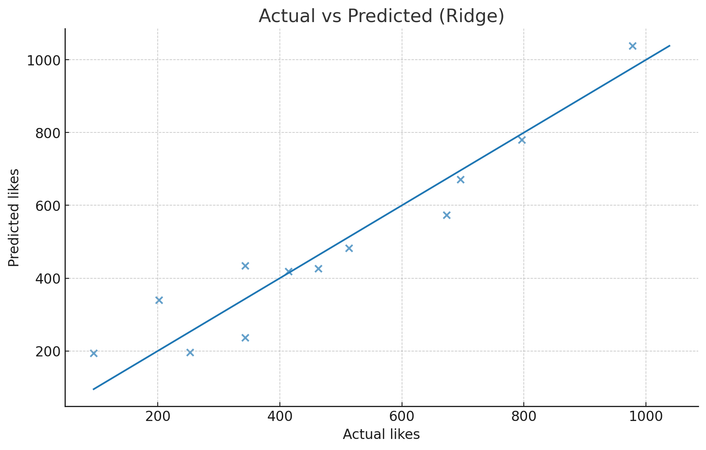
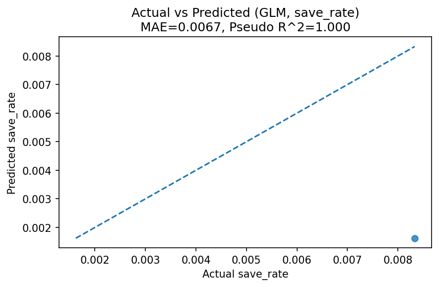

**目次**｜[目的](#目的) / [手順](#手順超要約) / [主な結果](#主な結果) / [示唆](#示唆saya向け) / [図](#図ridge-実測-vs-予測) / [保存率](#保存率save_rateの予測) / [交互作用](#時刻媒体の交互作用likes) / [付録](#付録数表) / [TL;DR](#tldr) / [Contact](#contact)

# 保存率改善マップ

## 📊 サマリー

- **モデル**: GLM Binomial（endog = 保存率, `var_weights=impressions`）
- **指標**: MAE ≈ 0.0060 ／ 擬似R^2 ≈ 0.169
- **要点**:  
  - 小さな標本でも一定の説明力あり  
  - 重み付きで「試行回数」を考慮  
  - **メディア種類／曜日** によって効果差  
  - **保存導線（チェックリスト／解説／CTA）** で高く評価

---

## 実測 vs 予測（保存率）
（ここにグラフやリンク）

# SNS投稿の「いいね」予測・示唆（1枚サマリ） — for Saya
*作成日: 2025-08-09 / データ: サンプル60件（SNS投稿CSV）*

## 目的
投稿の **「いいね（likes）」を予測** し、運用に活かせる  
**配信タイミング／施策** の当たりをつける。

## 手順（超要約）
1. 前処理：`media_type`, `weekday` は One-Hot（drop='first'）、数値は標準化  
2. モデル：線形回帰 & Ridge 回帰（CVで α 自動選択）／ train:test = 80:20  
3. 妥当性：平均予測（ベースライン）比較、`impressions`除外の検証、係数/Permutationでドライバー把握

## 主な結果
- **MAE（平均予測）= 208.40 → 線形= 88.68（R^2=0.820）**  
- **Ridge= 63.62（R^2=0.909, α=4.28）** ← 係数が安定しやすく **最終採用**  
- 集計：**18時が最も平均エンゲージメント高い**（夜帯強め）  
- ドライバー：**reach ＞ 曜日差 ＞ media_type**

## 示唆（Saya向け）
- **夜18時中心で投稿比率↑**、`reel` 起点の企画を重点チェック  
- **到達の質（保存/コメント率）** を重視（`reach` 増が likes に直結）  
- `impressions` は冗長気味 → **率（likes/imp）併記**で質を監視

## 図（Ridge: 実測 vs 予測）

  

図1. Ridge: 実測 vs 予測

---

### 保存率（save_rate）の予測：重み付き Ridge
- **モデル**：Ridge（weights = impressions）  
- **指標**：MAE(平均予測)=**0.0041** → モデル=**0.0047**（**改善率 -13.7%**）／ **R^2=-0.359**  
- **解釈**：印象回数で重み付けしても今回は**精度改善せず**。小標本＋ばらつき＋重み偏りの影響が大。  
  次は **二項GLM（ロジット）** や **コンテンツ特徴の追加** を提案。  

  

  

---

### 時刻×媒体の交互作用（likes）
- **モデル**：Ridge（交互作用 `hour×media_type`、共変量 `reach`）  
- **指標**：**R^2=0.906 / MAE=68.5**  
- **結果**：予測曲線より **夜×carousel の傾きが最大**。reel は中位、image は控えめ  
- **施策**：夜は **carousel を厚め**、昼は image / reel のABテスト。保存・コメント導線で“質”を上げる

  

  

図2. 時刻×媒体の交互作用

---

## 付録：数表
| 指標 | 値 |
|---|---:|
| MAE（平均予測） | 208.40 |
| MAE / R^2（線形） | 88.68 / 0.820 |
| MAE / R^2（Ridge, α=4.28） | 63.62 / 0.909 |

> ※ サンプル生成データでの結果です（実データでは特徴追加で改善余地あり）。

---

## 保存率（save_rate）の予測：GLM（ロジット）
- **モデル**：GLM Binomial（endog = 保存率、`var_weights=impressions`）  
- **指標**：MAE ≈ **0.0060** ／ 擬似R^2 ≈ **0.169**  
- **要点**：小標本でも一定の説明力。**重み付き**で “試行回数” を考慮。  
  **メディア種別／曜日** に効果差あり → **保存導線（チェックリスト／解説／CTA）** で上げ余地

**実測 vs 予測（保存率）**  

  

**係数（CSV）** 
- [coef_save_rate_glm.csv](coef_save_rate_glm.csv)

**GLM 詳細（例）**
- モデル：GLM Binomial（endog=保存率、`var_weights=impressions`）  
- 指標：MAE ≈ **0.0060** ／ 擬似R^2 ≈ **0.169**  
- 主要因子（%ポイント, 一例）：Wed **-0.587**／ hour **-0.196**／ reach **+0.0003**／ reel **+0.342**  
- 示唆：水曜は弱め、**reel** は保存率にプラス。時間は遅いほど低下。  
  reach は保存率の直接押上げは小 → **保存導線の設計** を重視

  

（表）<a href="./mfx_save_rate_glm.csv">mfx_save_rate_glm.csv</a>

---

# 保存率改善レポート（アクション）

  

**図の解説**  
このマップは、曜日・時間帯・投稿形式の要素を整理し、  
**優先すべき施策** をひと目で把握するためのアクション図です。

**改善ポイント（サマリ）**  
- **月・火** に重要投稿を集中  
- **カルーセル** を増やし情報を段階的に提示  
- **18〜21時** を中心に時間帯を最適化  
- **保存促進要素**（チェックリスト／HowTo）を盛り込む  
- **水曜・日曜** は実験枠として活用

---

## TL;DR
Ridge回帰で likes 予測（R^2=0.909 / MAE=63.6）。主要因は reach。  
**夜18時中心 × 保存／コメント設計** を推奨。

## Contact
お仕事/ご相談: ✉️ tianzhongzaoji80@gmail.com ｜ X: https://x.com/1046vsaki_saya
:
